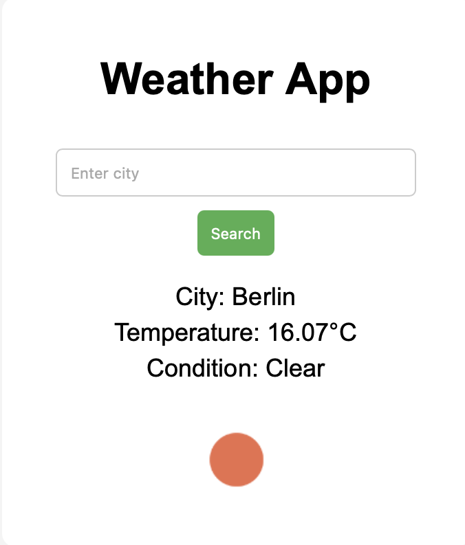

# Weather App

A simple weather application built with JavaScript that fetches real-time weather data from an API.

## Preview

## Features
- Search for any city
- Display real-time weather data
- Show temperature in Celsius
- Show weather condition
- Display weather icon
- Handle invalid input and errors

## Technologies
- HTML
- CSS
- JavaScript
- OpenWeatherMap API

## How to use
1. Enter a city name in the input field
2. Click the "Search" button or press Enter
3. View the weather information instantly

## What I learned
- How to work with APIs using fetch()
- Handling user input in JavaScript
- Updating the DOM dynamically
- Basic error handling and loading states
- Using Git and GitHub for version control

## Status
Finished – basic weather app with API integration

## Setup
1. Clone the repository
2. Open `index.html` in your browser

## Notes
This project was built as part of my preparation for studying Computer Science.
